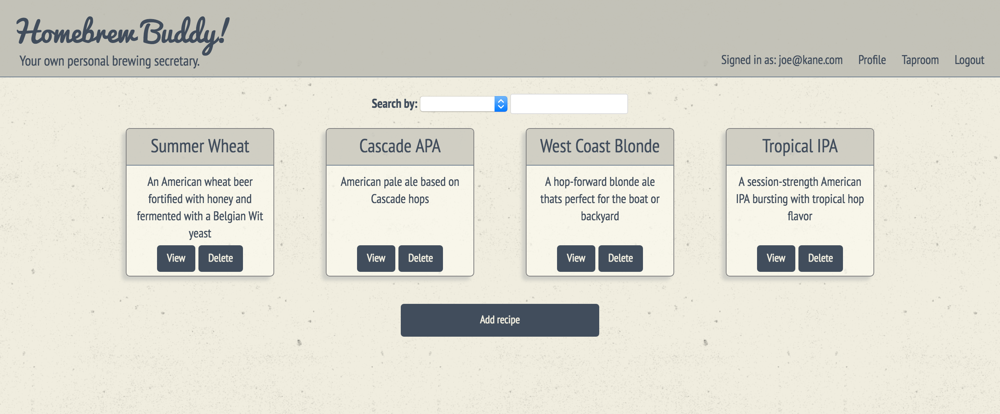
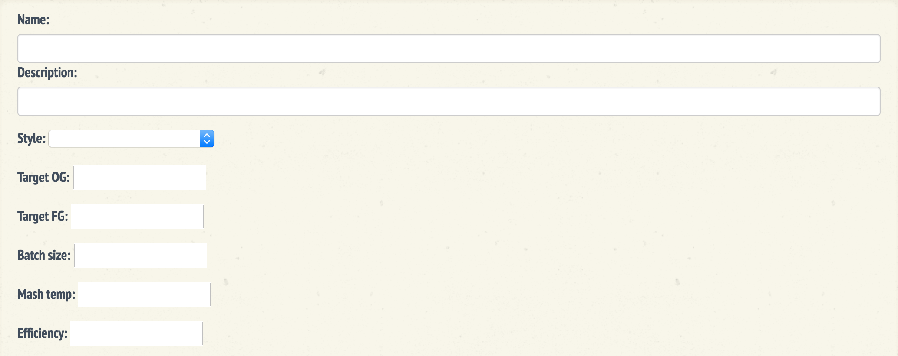
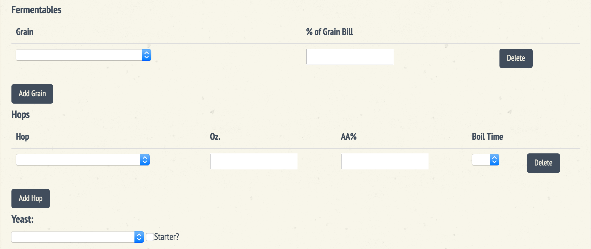
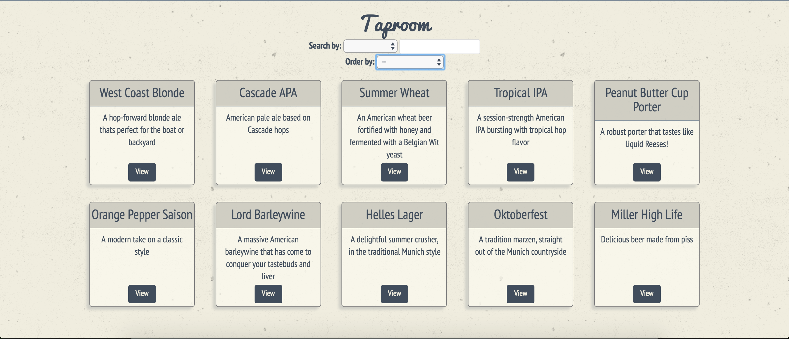

# Homebrew Buddy
#### Your very own homebrewing secretary

Homebrew Buddy is an app that is designed to calculate and store homebrewing recipes. You can also share, discuss, and copy other users favorite recipes.

##### Installation
To get started, you must first install the dependencies. Homebrew Buddy uses [AngularJS](https://github.com/angular/angular.js), [Firebase](https://firebase.google.com/), [Bootstrap](https://github.com/twbs/bootstrap), [Angular Filter](https://github.com/a8m/angular-filter), [Angular Route](https://github.com/angular/bower-angular-route), and [Angular toArray Filter](https://github.com/petebacondarwin/angular-toArrayFilter), as well as various [Gulp](https://github.com/gulpjs/gulp) tasks. Feel free to install with your favorite package manager (or CDN) or simply type the following prompts in your command line:

```$ bower install --save```

```$ npm install --save-dev```

##### Getting started
Homebrew Buddy is designed for the novice all-grain brewer that wants to start building his/her own recipes. Upon log-in, you will be taken to your profile page where you can view/delete previous recipes you have created, as well as add a new one. You can also search your recipes by name or style. Every recipe is completely modifiable, with a comments section for brew session/tasting notes.



##### Add New Recipe
To add a new recipe, simply click the "Add Recipe" button at the bottom of the page. Fill out ALL the requested information ("Style" is simply for your own cataloging purposes, it has no bearing on the recipe calculation function). Guidelines for beer styles are readily available from a variety of sources ([byo.com](https://byo.com/stories/beer-styles), Ray Daniel's [Designing Great Beers](https://www.amazon.com/dp/B00EO7UWFI/ref=dp-kindle-redirect?_encoding=UTF8&btkr=1#nav-subnav)).



##### Calculation

Once all the utility information has been filled out, click "Add Grain" and select a grain from the dropdown menu. Enter the percentage of the grain bill that grain will occupy.
**CAVEAT:** As of this update (7/7/2016), the API that Homebrew Buddy utilizes for grain and hop selection is constantly being updated, yet remains incomplete. Not all grains provide the information required to accurately calculate the grain bill.

Fill out the hop bill much the same as the grain. It would be best to know the AA% of the individual hops before calculation, but there are a variety of online sources that provide average ranges of a given hop.



##### Taproom

When a recipe has been dialed in to perfection, its time to share! From the recipe view page, scroll to the bottom and click "Tap!" This will add the recipe to the Taproom, a virtual public house where homebrewers can share and discuss their favorite recipes. If a recipe looks intriguing, scroll to the bottom of the view and click "Fork." This will add that recipe to the current users profile, where they can brew/tweak as they would a recipe of thier own.



Thanks so much for checking out Homebrew Buddy, we hope you enjoy and make great beer!
